

ANIMAL BALL FIGHTER
한 번의 드래그로 캐릭터를 발사하고
충돌, 스킬, 증강을 조합해 방을 돌파하는
3D 물리 기반 모바일 로그라이크 액션 게임

프로젝트 소개
Animal Ball Fighter는 캐릭터를 드래그해 발사한 뒤
벽과 적에게 튕기며 전투하는 세로형 Android 게임입니다.
플레이어는 캐릭터마다 다른 스킬을 활용하고,
전투 보상으로 제시되는 증강을 선택해 능력치를 강화하며
3개 스테이지, 총 15개의 방을 순서대로 돌파합니다.
전투 구현뿐 아니라 Addressables 기반 콘텐츠 로딩,
모바일 최적화, 보상형 광고, 결제 검증, 개인정보 동의와 다국어 설정까지
하나의 앱 흐름으로 연결하는 것을 목표로 개발했습니다.
<!--

  

-->

Links
<!-- 아래 URL을 실제 링크로 교체하세요. -->

  
  &nbsp;
  

개발 정보
- 엔진 : Unity 6000.3.5f2
- 언어 : C#
- 형태 : 개인 포트폴리오 프로젝트
- 플랫폼 : Android
- 빌드 환경 : IL2CPP / ARM64
- 개발 기간 : 2026.06.19 ~ 2026.10
- 개발 인원 : 1명
- 배포 상태 : Google Play 비공개 테스트 완료 / 프로덕션 액세스 검토 중
- 핵심 구현 :
  - 드래그 발사와 충돌 기반 물리 전투
  - ScriptableObject 기반 캐릭터, 증강, 적 데이터 관리
  - Addressables 라벨 로딩과 전투 준비 동기화
  - 동일 프레임 충돌 피드백 요청 병합
  - LevelPlay 보상형 광고와 부활 상태 복구
  - Unity IAP 거래 ID 기반 중복 지급 차단
  - 개인정보 동의 저장과 한국어 / 영어 전환
플레이 흐름
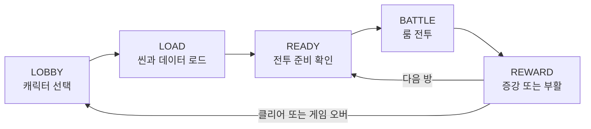
- 캐릭터 선택 후 전투 씬과 Addressables 데이터를 비동기로 불러옵니다.
- 씬, 적 데이터, 오브젝트 풀이 모두 준비된 뒤 전투를 시작합니다.
- 일반, 정예, 이벤트, 보스 방을 진행하며 증강을 선택합니다.
- 게임 오버 시 보상형 광고를 통해 플레이당 한 번 부활할 수 있습니다.
주요 기능
1. 드래그 발사와 충돌 전투
드래그 거리와 카메라 방향을 기준으로 발사 방향과 힘을 계산하고,
충돌 시 공격력과 현재 속도를 함께 사용해 피해량을 결정합니다.
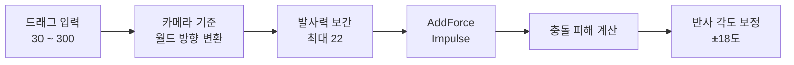
Damage = Attack × 0.6 + Speed × 0.8
- 발사 강도는 첫 충격량에 반영하고 이후 속도는 캐릭터 능력치에 맞춰 유지합니다.
- 벽과 적 충돌 후 진행 각도를 ±18도 보정해 모서리 반복 반사를 줄였습니다.
- 이동 속도가 0.1 미만이면 마지막 진행 방향을 기준으로 움직임을 복구합니다.
- 치명타 여부에 따라 피해 텍스트와 카메라 피드백을 구분합니다.
<!--

  

-->

2. 데이터 기반 캐릭터와 증강
캐릭터, 증강, 적 정보를 ScriptableObject로 분리해
씬 코드의 직접 참조를 줄이고 콘텐츠를 데이터 단위로 관리했습니다.
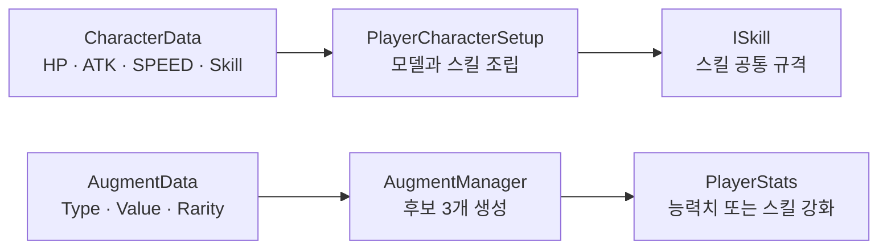
- 캐릭터별 능력치와 스킬 리소스를 CharacterData에서 관리합니다.
- 고양이, 돼지, 병아리 캐릭터의 스킬을 ISkill 규격으로 교체할 수 있게 구성했습니다.
- 증강 후보는 중복을 제거한 뒤 무작위 3개를 제시합니다.
- 이미 보유한 스킬 증강이 다시 선택되면 스킬 레벨을 올립니다.
<!--

  

-->

3. 룸과 보스 진행
각 스테이지는 5개의 방으로 구성되며
RoomManager와 BossController가 전투 진행과 보스 패턴 실행을 담당합니다.
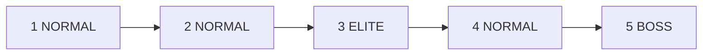
- 총 3개 스테이지, 15개 방을 순서대로 진행합니다.
- 일반, 정예, 보스 적 데이터를 분리해 방 종류에 맞게 생성합니다.
- 보스 패턴은 준비, 실행, 종료 상태를 나눠 중복 실행을 막습니다.
- 경고선, 미사일 범위, 레이저 판정으로 공격 범위를 사전에 전달합니다.
4. Addressables 콘텐츠 로딩
씬이 개별 콘텐츠 목록을 직접 보유하지 않고
역할별 라벨을 요청해 런타임 목록을 구성하도록 만들었습니다.
- 관리 콘텐츠 : 17개
- Addressables 라벨 : 4개
  - Augment
  - EnemyData_Normal
  - EnemyData_Elite
  - EnemyData_Boss
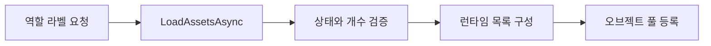
전투 준비 동기화
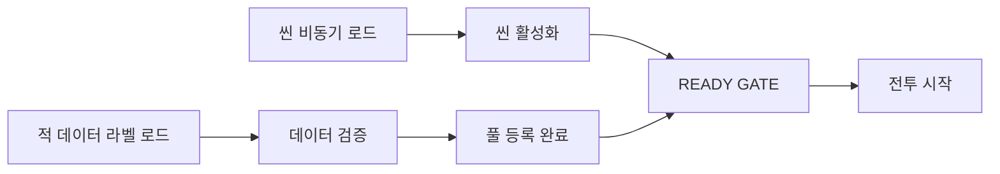
- 씬과 데이터가 모두 준비된 뒤에만 전투를 시작합니다.
- 준비 시간이 10초를 넘거나 데이터가 비어 있으면 전투를 차단하고 로비로 복귀합니다.
- 씬 종료 시 유효한 Addressables Handle을 해제합니다.
<!--

  

-->

5. 로딩 진행률 구성
씬 로드가 끝난 뒤에도 데이터 초기화가 이어지는 점을 고려해
진행률을 실제 준비 단계에 맞춰 세 구간으로 나눴습니다.
구간	처리 내용
0 ~ 90%	씬 비동기 로드
90 ~ 95%	씬 초기화와 전투 준비 확인
95 ~ 100%	로딩 화면 Fade Out

- 최소 노출 시간을 적용해 화면이 순간적으로 깜빡이지 않도록 했습니다.
- 데이터 초기화 구간을 표시해 진행률이 멈춘 것처럼 보이는 문제를 줄였습니다.
- Fade Out 완료 후 전투 UI로 자연스럽게 전환합니다.
6. 충돌 피드백 요청 병합
기존에는 충돌 이벤트마다 효과음과 카메라 흔들림을 바로 실행했습니다.
개선 후에는 전투 코드가 CombatFeedbackManager에 요청만 전달하고,
매니저가 같은 프레임의 요청을 정리한 뒤 제한된 주기로 실행합니다.
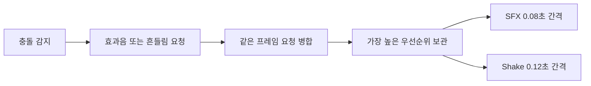
- 같은 프레임의 효과음은 최대 한 번만 실행합니다.
- 카메라 흔들림은 치명타 충돌에서만 요청합니다.
- 겹친 흔들림은 가장 긴 시간과 가장 높은 강도를 남깁니다.
Profiler 비교
동일 프레임에 충돌 피드백 요청 24회를 발생시키는
동일한 Unity Editor 스트레스 조건의 선택 프레임을 비교했습니다.
항목	개선 전	개선 후
PlayerLoop	31.60 ms	2.31 ms
GC Alloc	75.2 KB	368 B
Audio Voices	197	5
Total Audio CPU	1.0%	0.3%

<!--

  

-->

7. LevelPlay 보상형 광고와 부활
게임 로직은 광고를 직접 제어하지 않고 AdManager에 요청만 전달합니다.
개인정보 동의, 초기화, 로드, 표시, 보상과 실패 처리는
AdManager가 한 곳에서 관리합니다.
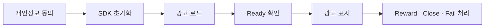
- 광고가 준비되지 않았으면 로드를 요청하고 완료 후 표시합니다.
- 중복 로드와 중복 표시를 상태값으로 차단합니다.
- 보상 콜백을 받은 경우에만 골드 또는 부활 처리를 실행합니다.
- 광고 종료 후 다음 요청을 위해 새 광고를 로드합니다.
부활 상태 복구
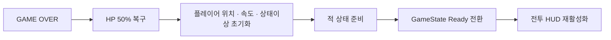
- HP만 회복하지 않고 플레이어, 적, 게임 상태와 UI를 정해진 순서로 복구합니다.
- 보상형 광고 부활은 플레이당 한 번만 사용할 수 있습니다.
- Unity Editor Mock 광고와 Android 실기기 광고를 각각 확인했습니다.
<!--

  

-->

8. Unity IAP 중복 지급 차단
구매 성공 시 골드와 거래 ID를 함께 저장하고,
같은 거래 ID가 다시 전달되면 보상을 지급하지 않도록 구성했습니다.
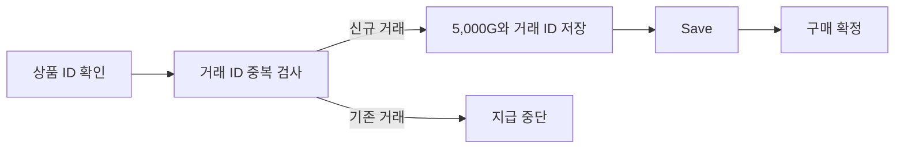
- Unity Services 초기화 후 Store에 연결합니다.
- gold_5000 상품을 조회해 현지 가격을 표시합니다.
- 저장이 완료된 뒤 구매를 확정해 재실행 시 중복 지급을 막습니다.
Unity IAP 기능은 구현과 Android 실기기 결제 테스트를 완료했지만,
사업자 등록 및 정산 계정 준비 문제로 정식 출시 빌드에서는 제외했습니다.

9. 개인정보 동의와 다국어 설정
광고 동의와 언어 설정을 저장해
씬이 바뀌거나 앱을 다시 실행해도 같은 선택을 유지합니다.
개인정보 동의
- 첫 실행 시 저장된 선택을 확인합니다.
- 동의와 거부를 모두 제공합니다.
- 선택 결과를 PlayerPrefs에 저장합니다.
- LevelPlay 초기화 전에 GDPR 동의값을 전달합니다.
- 설정 화면에서 개인정보 선택창을 다시 열 수 있습니다.
한국어 / 영어 전환
- Localization 초기화가 끝날 때까지 기다립니다.
- 저장된 언어를 SelectedLocale에 적용합니다.
- LocaleChanged 이벤트에서 현재 화면을 갱신합니다.
- 씬 전환 후에도 선택한 언어를 유지합니다.
<!--

  

-->

앱 구조
플레이 흐름은 한 방향으로 유지하고,
비동기 콘텐츠 준비와 외부 SDK 처리는 전담 관리자로 분리했습니다.
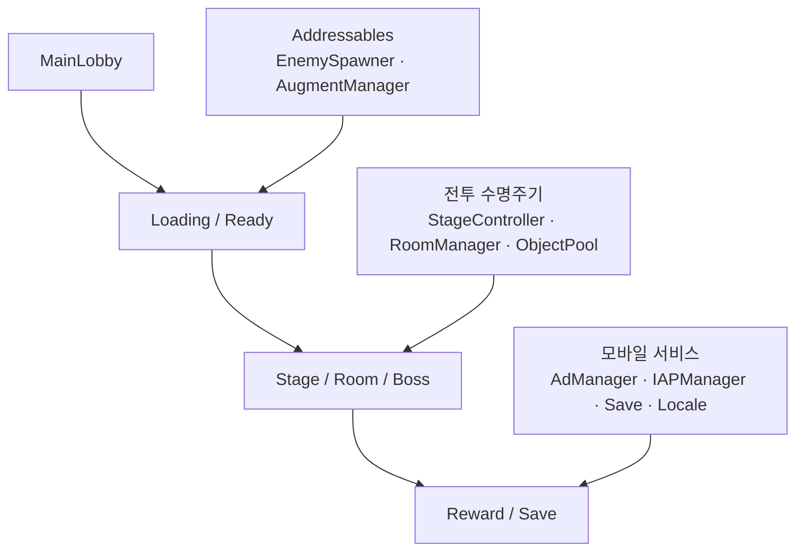
AI 활용 개발 과정
ChatGPT와 Codex를 구조 검토와 디버깅 보조 도구로 사용했습니다.
AI가 제시한 결과를 그대로 적용하지 않고, 프로젝트 규칙에 맞게 수정한 뒤
Unity 실행 결과, Profiler 수치와 Android 실기기 테스트를 기준으로 최종 결정했습니다.
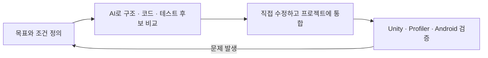
- CombatFeedbackManager 요청 병합 구조 비교
- LevelPlay 초기화, 로드, 보상 콜백 흐름 점검
- Profiler A/B 조건과 Android 실기기 테스트 항목 구성
브랜치 전략
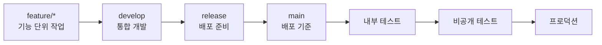
- main : 배포 기준
- develop : 기능 통합과 테스트
Commit 메시지 규칙
- Feat : 새로운 기능 추가
- Fix : 버그 수정
- Design : UI 디자인 변경
- HOTFIX : 치명적인 오류 긴급 수정
- Comment : 주석 추가 또는 변경
- Docs : 문서 수정
- Style : 코드 동작에 영향을 주지 않는 형식 수정
- Refactor : 코드 리팩토링
- Test : 테스트 코드 또는 테스트 기능 추가와 수정
- Chore : 빌드 설정과 패키지 수정
- Rename : 파일 또는 폴더 이름 변경과 이동
- Remove : 파일 삭제
프로젝트 폴더 관리
- Scripts : Core, Player, Enemy, Boss, UI, Service 스크립트
- Prefabs : 캐릭터, 적, VFX, UI 프리팹
- Scenes : 로비와 스테이지 씬
- ScriptableObjects : CharacterData, EnemyData, AugmentData
- AddressableAssetsData : Addressables 그룹과 라벨 설정

Animal Ball Fighter
Unity 6 / Android

